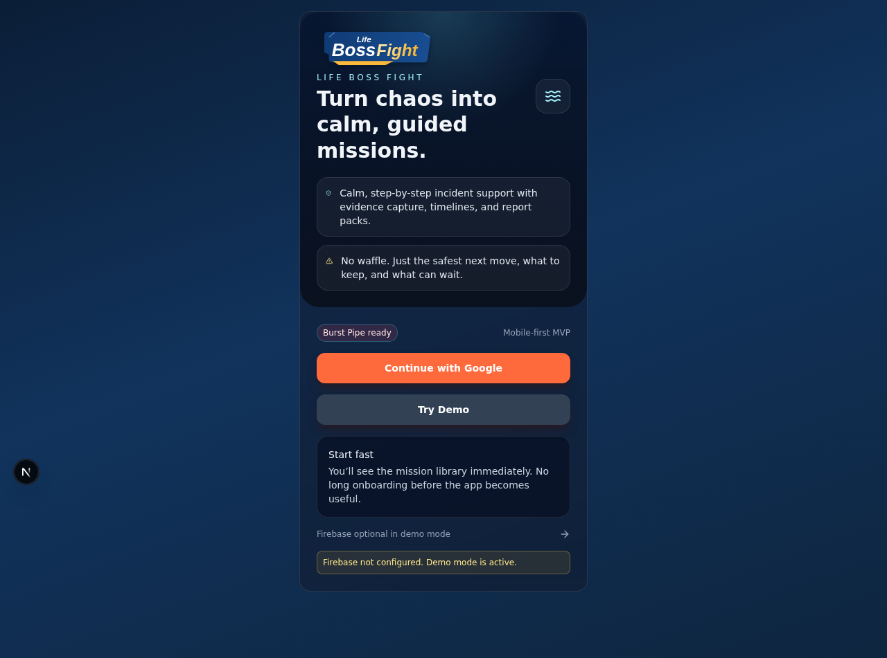

# Firebase Authentication Integration Guide for Life Boss Fight

This guide shows how to integrate Firebase Authentication into Life Boss Fight's TypeScript/Next.js codebase. It assumes you already know TypeScript, but not Firebase.

> Current repo status: the app already includes Firebase SDK dependencies, a shared Firebase config module in `src/lib/firebase/config.ts`, Google sign-in on `src/app/(auth)/login/page.tsx`, and a demo-mode fallback when Firebase environment variables are missing. The steps below explain how to complete a production-ready account system on top of that foundation.

## What you will set up
- A Firebase project and web app
- Firebase Authentication providers (Email/Password and Google)
- Safe environment variable handling for local, test, preview, and production environments
- Login, registration, logout, password reset, and auth-state UX flows in Life Boss Fight
- Token/session handling in the browser and on protected routes
- Firestore or Realtime Database rules for user-scoped data
- Recommended testing and release checks

## Official Firebase docs
- [Firebase: Add Firebase to your JavaScript project](https://firebase.google.com/docs/web/setup)
- [Firebase Authentication for web](https://firebase.google.com/docs/auth/web/start)
- [Email/password auth](https://firebase.google.com/docs/auth/web/password-auth)
- [Google sign-in](https://firebase.google.com/docs/auth/web/google-signin)
- [Manage users](https://firebase.google.com/docs/auth/web/manage-users)
- [Cloud Firestore security rules](https://firebase.google.com/docs/firestore/security/get-started)
- [Realtime Database security rules](https://firebase.google.com/docs/database/security)
- [Firebase App Check](https://firebase.google.com/docs/app-check)

## 1. Create a Firebase project
1. Open the [Firebase console](https://console.firebase.google.com/).
2. Select **Create a project**.
3. Enter a project name such as `life-boss-fight-dev`.
4. Decide whether Google Analytics is needed for that environment. If you do not need Analytics yet, you can disable it and add it later.
5. Finish project creation.

### Recommended project layout
Use separate Firebase projects for each environment so credentials, auth users, and data stay isolated.

| Environment | Suggested Firebase project |
| --- | --- |
| Local development | `life-boss-fight-dev` |
| Shared testing / QA | `life-boss-fight-test` |
| Production | `life-boss-fight-prod` |

## 2. Register the Life Boss Fight web app
1. In Firebase, open **Project settings**.
2. Under **Your apps**, choose **Web** (`</>` icon).
3. Register the app with a name like `Life Boss Fight Web`.
4. Do not enable Firebase Hosting here unless you explicitly need it; Vercel already handles deployment for this repo.
5. Copy the generated Firebase config values.

### Screenshot: current login experience
The current repository already exposes a login page with Google sign-in and demo fallback.



### Screenshot checklist to capture in your own Firebase project
Because Firebase console layouts change over time, capture these screenshots for your team wiki when you configure your project:
1. **Project settings > Your apps > Web app config**
2. **Authentication > Sign-in method** with enabled providers
3. **Firestore Database > Rules** after publishing security rules
4. **Authentication > Templates** if you customize password reset or verification emails

## 3. Confirm SDK packages
The repository already includes the main SDK package:

```json
{
  "dependencies": {
    "firebase": "^11.0.1"
  }
}
```

If you need to install it again in a fresh clone:

```bash
npm install firebase
```

Life Boss Fight already uses the modular Web SDK, which is the correct approach for tree-shaking and TypeScript.

## 4. Configure environment variables
Update `.env.local` for local development. The project already ships `.env.example` with the required keys.

```bash
NEXT_PUBLIC_FIREBASE_API_KEY=
NEXT_PUBLIC_FIREBASE_AUTH_DOMAIN=
NEXT_PUBLIC_FIREBASE_PROJECT_ID=
NEXT_PUBLIC_FIREBASE_STORAGE_BUCKET=
NEXT_PUBLIC_FIREBASE_MESSAGING_SENDER_ID=
NEXT_PUBLIC_FIREBASE_APP_ID=
NEXT_PUBLIC_ENABLE_DEMO=true
```

### How the repo currently uses these values
`src/lib/firebase/config.ts` initializes Firebase only when every required `NEXT_PUBLIC_FIREBASE_*` value is present:

```ts
import { initializeApp, getApps } from 'firebase/app';
import { getAuth, GoogleAuthProvider } from 'firebase/auth';
import { getFirestore } from 'firebase/firestore';
import { getStorage } from 'firebase/storage';

const firebaseConfig = {
  apiKey: process.env.NEXT_PUBLIC_FIREBASE_API_KEY,
  authDomain: process.env.NEXT_PUBLIC_FIREBASE_AUTH_DOMAIN,
  projectId: process.env.NEXT_PUBLIC_FIREBASE_PROJECT_ID,
  storageBucket: process.env.NEXT_PUBLIC_FIREBASE_STORAGE_BUCKET,
  messagingSenderId: process.env.NEXT_PUBLIC_FIREBASE_MESSAGING_SENDER_ID,
  appId: process.env.NEXT_PUBLIC_FIREBASE_APP_ID
};

export const hasFirebaseConfig = Object.values(firebaseConfig).every(Boolean);
export const app = hasFirebaseConfig ? getApps()[0] ?? initializeApp(firebaseConfig) : null;
export const auth = app ? getAuth(app) : null;
export const googleProvider = new GoogleAuthProvider();
export const db = app ? getFirestore(app) : null;
export const storage = app ? getStorage(app) : null;
```

### Environment handling guidance
- `.env.local`: developer-specific secrets for local work
- `.env.test` or CI secrets: dedicated testing credentials if you add auth-aware integration tests
- Vercel Preview: preview Firebase project or restricted preview credentials
- Vercel Production: production Firebase project only
- Never hard-code Firebase config or service-account secrets in source files
- Keep Admin SDK secrets server-side only if you later add server actions or API routes

## 5. Enable Firebase Authentication providers
Open **Firebase console > Authentication > Sign-in method** and enable the providers you need.

### Email/Password
1. Enable **Email/Password**.
2. Decide whether email verification is required before full access.
3. Configure email templates under **Authentication > Templates**.

### Google
1. Enable **Google**.
2. Set a support email.
3. Add your production domain and preview domains to the authorized domain list.

### Optional providers to consider later
- Apple
- Microsoft
- Phone authentication
- Anonymous auth for temporary guest sessions

## 6. Build a shared auth service layer
Keep Firebase auth calls out of page components when possible. Add or expand a helper module such as `src/lib/firebase/auth.ts`.

```ts
import {
  GoogleAuthProvider,
  UserCredential,
  createUserWithEmailAndPassword,
  sendPasswordResetEmail,
  sendEmailVerification,
  signInWithEmailAndPassword,
  signInWithPopup,
  signOut
} from 'firebase/auth';
import { auth } from '@/lib/firebase/config';

const ensureAuth = () => {
  if (!auth) {
    throw new Error('Firebase Auth is not configured.');
  }

  return auth;
};

export async function registerWithEmail(email: string, password: string): Promise<UserCredential> {
  const instance = ensureAuth();
  const credential = await createUserWithEmailAndPassword(instance, email, password);
  await sendEmailVerification(credential.user);
  return credential;
}

export function loginWithEmail(email: string, password: string) {
  return signInWithEmailAndPassword(ensureAuth(), email, password);
}

export function loginWithGoogle() {
  return signInWithPopup(ensureAuth(), new GoogleAuthProvider());
}

export function resetPassword(email: string) {
  return sendPasswordResetEmail(ensureAuth(), email);
}

export function logout() {
  return signOut(ensureAuth());
}
```

Why this matters:
- Page components stay focused on UX
- Error handling is consistent
- Tests can mock one auth module instead of many Firebase calls

## 7. Add registration and login flows to the app
The repo currently includes a Google sign-in button and demo entry point on `src/app/(auth)/login/page.tsx`. To support full account flows, add dedicated forms for registration, login, and password reset.

### Example registration form
```tsx
'use client';

import { useState } from 'react';
import { useRouter } from 'next/navigation';
import { registerWithEmail } from '@/lib/firebase/auth';

export function RegisterForm() {
  const router = useRouter();
  const [email, setEmail] = useState('');
  const [password, setPassword] = useState('');
  const [busy, setBusy] = useState(false);
  const [error, setError] = useState<string | null>(null);

  const handleSubmit = async (event: React.FormEvent<HTMLFormElement>) => {
    event.preventDefault();
    setBusy(true);
    setError(null);

    try {
      await registerWithEmail(email, password);
      router.push('/home');
    } catch (err) {
      setError(err instanceof Error ? err.message : 'Registration failed.');
    } finally {
      setBusy(false);
    }
  };

  return (
    <form onSubmit={handleSubmit} className="space-y-4">
      <input
        required
        type="email"
        value={email}
        onChange={(event) => setEmail(event.target.value)}
        placeholder="you@example.com"
      />
      <input
        required
        minLength={8}
        type="password"
        value={password}
        onChange={(event) => setPassword(event.target.value)}
        placeholder="Create a strong password"
      />
      <button disabled={busy} type="submit">
        {busy ? 'Creating account…' : 'Create account'}
      </button>
      {error ? <p role="alert">{error}</p> : null}
    </form>
  );
}
```

### Example login form
```tsx
import { loginWithEmail } from '@/lib/firebase/auth';

async function handleEmailLogin(email: string, password: string) {
  await loginWithEmail(email, password);
}
```

### Recommended routing
- `/login`: sign in form with Google and Email/Password options
- `/register`: account creation
- `/forgot-password`: password reset request
- `/home`: authenticated landing screen

### Form validation guidance
Use the repo's existing `zod` and `react-hook-form` stack for:
- email format validation
- minimum password length
- password confirmation matching
- friendly field-level error messages

## 8. Manage auth state, tokens, and sessions
Firebase Auth persists browser sessions automatically, but your app still needs a single source of truth for auth state.

### Recommended client-side auth listener
```ts
import { onAuthStateChanged } from 'firebase/auth';
import { auth } from '@/lib/firebase/config';

export function subscribeToAuthState(callback: (uid: string | null) => void) {
  if (!auth) {
    callback(null);
    return () => undefined;
  }

  return onAuthStateChanged(auth, (user) => {
    callback(user?.uid ?? null);
  });
}
```

### Token guidance
- Use `user.getIdToken()` when you need an ID token for a backend request
- Use `user.getIdTokenResult()` if you later rely on custom claims or role metadata
- Do not store raw tokens manually in `localStorage` unless you have a clear server integration reason
- Prefer Firebase's built-in persistence for browser sessions
- If you later add server-rendered auth checks, exchange the ID token for a secure HTTP-only session cookie on the server

### Current repo note
The MVP currently stores a lightweight demo session string in `localStorage` via `src/lib/store/demo-store.ts`. Keep that only for demo mode. Do not treat the demo session model as the production auth model.

## 9. Protect routes and restore sessions
For production auth, redirect unauthenticated users away from authenticated pages.

### Recommended approach
1. Create an auth context/provider that subscribes to Firebase auth state.
2. Show a loading state while auth initializes.
3. Guard routes such as `/home`, `/launch/[slug]`, and `/runs/[runId]`.
4. Redirect unauthenticated users to `/login`.
5. Allow demo mode only when `NEXT_PUBLIC_ENABLE_DEMO=true` and your product requirements explicitly allow it.

### Example protected layout pattern
```tsx
'use client';

import { useEffect } from 'react';
import { useRouter } from 'next/navigation';
import { useAuth } from '@/components/auth/auth-provider';

export function ProtectedAppShell({ children }: { children: React.ReactNode }) {
  const router = useRouter();
  const { status, user } = useAuth();

  useEffect(() => {
    if (status === 'signed-out') {
      router.replace('/login');
    }
  }, [router, status]);

  if (status === 'loading') {
    return <p>Checking your account…</p>;
  }

  if (!user) {
    return null;
  }

  return <>{children}</>;
}
```

## 10. Persist user profiles in Firestore
Once a user signs in, create or update a profile document. That lets you store display name, onboarding state, and app-specific settings.

```ts
import { doc, serverTimestamp, setDoc } from 'firebase/firestore';
import { db } from '@/lib/firebase/config';

export async function upsertUserProfile(user: {
  uid: string;
  displayName: string | null;
  email: string | null;
  photoURL: string | null;
}) {
  if (!db) throw new Error('Firestore is not configured.');

  await setDoc(
    doc(db, 'users', user.uid),
    {
      name: user.displayName ?? '',
      email: user.email ?? '',
      photoUrl: user.photoURL ?? '',
      updatedAt: serverTimestamp(),
      createdAt: serverTimestamp()
    },
    { merge: true }
  );
}
```

This aligns with the existing collection guidance in `docs/firestore-schema.md`.

## 11. Handle errors and password resets well
Firebase returns structured auth errors like `auth/email-already-in-use` or `auth/invalid-credential`. Convert those into human-readable messages.

### Example error mapping
```ts
const authErrorMessages: Record<string, string> = {
  'auth/email-already-in-use': 'An account already exists for that email address.',
  'auth/invalid-credential': 'Your email or password was incorrect.',
  'auth/popup-closed-by-user': 'Google sign-in was cancelled before it completed.',
  'auth/too-many-requests': 'Too many attempts were made. Please wait and try again.',
  'auth/user-not-found': 'No account was found for that email address.',
  'auth/weak-password': 'Choose a stronger password with at least 8 characters.'
};
```

### Password reset flow
1. Add a `Forgot password?` link from login.
2. Collect the user's email.
3. Call `sendPasswordResetEmail`.
4. Show success feedback even if the email is unknown, to avoid account enumeration.
5. Confirm the reset email template is branded and points back to the correct environment.

## 12. Provide clear UI feedback for auth states
Every auth screen should clearly show:
- idle state
- loading state
- success state
- recoverable error state
- fallback/demo availability
- disabled controls while a request is in flight

### UX checklist
- Disable submit buttons while requests are pending
- Use inline error text and `role="alert"` for accessibility
- Show loading text such as `Signing you in…`
- Confirm when reset emails are sent
- Explain when Firebase is unavailable and demo mode is active
- Distinguish between verification-required and fully signed-in states

## 13. Configure Firestore or Realtime Database securely
If you use Firestore, start with owner-only rules and relax them only when you truly need shared access.

### Example Firestore rules
```txt
rules_version = '2';
service cloud.firestore {
  match /databases/{database}/documents {
    function isSignedIn() {
      return request.auth != null;
    }

    function isOwner(userId) {
      return isSignedIn() && request.auth.uid == userId;
    }

    match /users/{userId} {
      allow read, write: if isOwner(userId);
    }

    match /missionRuns/{runId} {
      allow create: if isSignedIn() && request.resource.data.userId == request.auth.uid;
      allow read, update, delete: if isSignedIn() && resource.data.userId == request.auth.uid;
    }

    match /evidenceItems/{evidenceId} {
      allow create: if isSignedIn() && request.resource.data.userId == request.auth.uid;
      allow read, update, delete: if isSignedIn() && resource.data.userId == request.auth.uid;
    }
  }
}
```

### Example Realtime Database rules
Use Realtime Database only if you specifically need that data model; Firestore is the repo's closer fit today.

```json
{
  "rules": {
    "users": {
      "$uid": {
        ".read": "auth != null && auth.uid === $uid",
        ".write": "auth != null && auth.uid === $uid"
      }
    }
  }
}
```

### Storage rules reminder
If you later sync evidence uploads to Firebase Storage, add matching Storage rules so users only access their own files.

## 14. Local, testing, preview, and production notes
### Local development
- Keep `NEXT_PUBLIC_ENABLE_DEMO=true` while iterating on non-auth features
- Use a dedicated development Firebase project so test users do not pollute production
- Restart `npm run dev` after env changes

### Automated testing
- Unit tests can mock `src/lib/firebase/config.ts` and any auth helpers
- Integration tests should use Firebase emulators if you add database or auth integration coverage
- E2E tests should run against a disposable test project or emulator-backed environment

### Preview deployments
- Decide whether previews should allow real logins, demo mode only, or a dedicated preview Firebase project
- Ensure preview URLs are added to Firebase authorized domains if Google sign-in is enabled there

### Production
- Disable demo mode unless it is an intentional product feature
- Use production-only Firebase credentials in Vercel Production settings
- Review email templates, OAuth domains, rules, and monitoring before launch

## 15. Recommended test scenarios
### Unit tests
- auth helper returns friendly mapped errors
- missing Firebase config falls back safely
- auth state provider renders loading, signed-in, and signed-out states
- password reset form validates email input

### Integration tests
- successful profile creation after first login
- protected route redirects when signed out
- Firestore writes include `userId` and required fields
- logout clears app state and returns to `/login`

### End-to-end tests
- register with email/password
- verify login with email/password
- sign in with Google in a configured environment
- request password reset
- access protected app routes after refresh
- confirm demo mode messaging when Firebase config is missing

### Manual production checks
- disabled buttons during requests
- mobile keyboard behavior on auth forms
- error copy for invalid credentials and popup cancellations
- verification email and reset email links land in the correct environment

## 16. Suggested implementation order for this repo
1. Keep the existing `src/lib/firebase/config.ts` as the shared initialization point.
2. Add `src/lib/firebase/auth.ts` for provider-specific auth operations.
3. Add `src/components/auth/` UI primitives and an auth provider.
4. Expand `src/app/(auth)/login/page.tsx` to include Email/Password and password reset entry points.
5. Add a `register` route.
6. Add protected-layout logic for authenticated app routes.
7. Persist user profiles to Firestore.
8. Add tests for auth helpers and protected-route behavior.
9. Publish Firebase rules before exposing production sign-ups.

## 17. Production-readiness checklist
- [ ] Firebase project created per environment
- [ ] Web app registered and config copied into env vars
- [ ] Email/Password and Google providers enabled
- [ ] Authorized domains configured for local, preview, and production URLs
- [ ] Auth helper module added and tested
- [ ] Registration, login, logout, and password reset flows implemented
- [ ] Auth state provider and route protection implemented
- [ ] Firestore profile persistence working
- [ ] Security rules published and reviewed
- [ ] Demo mode policy decided for production
- [ ] Error tracking and analytics added to auth flows
- [ ] End-to-end auth scenarios validated

## 18. Related repository docs
- `README.md`
- `docs/firestore-schema.md`
- `src/lib/firebase/config.ts`
- `src/app/(auth)/login/page.tsx`
- `src/lib/store/demo-store.ts`
